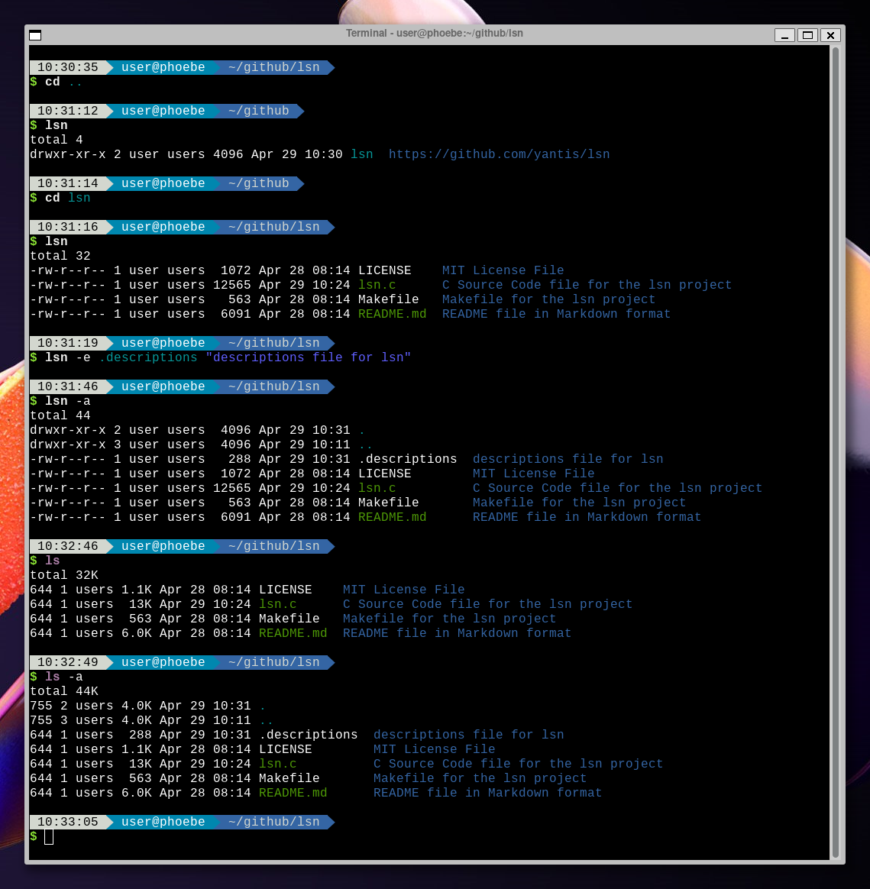

## lsn - List with Notes

lsn is a command-line utility that extends the ls command by adding the ability to display descriptions for files and directories. It allows you to set, update, and display descriptions for files in the terminal alongside their names. Inspired by 4DOS file descriptions, this modernized utility brings the convenience and organization of file descriptions to the Linux command line.

## Features

- Display files and directories with descriptions
- Set or update descriptions for files and directories
- Descriptions are stored in a hidden file within the directory
- Inspired by the 4DOS file description system
- Written in C for speed





## Installation

1. Clone the repository:
    ```
    git clone https://github.com/yantis/lsn.git
    ```
2. Change to the cloned directory:
    ```
    cd lsn
    ```
3. Compile the source code using the provided Makefile:
    ```
    make
    ```
4. (Optional) Add the compiled lsn executable to your $PATH to make it available system-wide.


## Archlinux 
If you use Archlinux there is a package on the AUR called lsn-git
https://aur.archlinux.org/packages/lsn-git


## Usage

lsn [OPTION]... [FILE]... [DESCRIPTION]...
lsn (any ls argument)

### Options

- --help: Display help information and exit
- -e, --extended-description: Set the description for a file
Any other arguments are directly passed to ls

### Examples

List files and directories with descriptions:

lsn

Set a description for a file:

lsn -e file.txt 'my description'

## 4DOS File Descriptions

4DOS was a popular command-line interpreter for MS-DOS and IBM PC DOS systems in the late 1980s and early 1990s. It introduced the concept of file descriptions, which allowed users to add a brief note to files and directories to help them remember their contents or purpose. This was particularly useful in a time when storage capacity and file management tools were limited, and long file names were not supported by file systems.

4DOS stored file descriptions in a special file named descript.ion. In our implementation, we use a similar approach by storing file descriptions in a .descriptions file. This approach pays homage to the 4DOS concept while adapting it for modern file systems and workflows.

File descriptions were useful back then because they allowed users to add meaningful context to files without relying on long file names, which were not supported by the file systems of that era. These descriptions made it easier for users to organize and manage their files, especially when dealing with a large number of files.

Today, with vastly improved storage capacities and file management systems, file descriptions can still provide significant benefits. They can help users quickly understand the purpose of a file or directory, improve organization, and reduce the time spent searching for specific files. File descriptions can be particularly helpful in situations where file names are cryptic or not self-explanatory.

## Real-Life Examples

Here are some real-life examples of how lsn could be useful:

- Software development: A developer working on a project with multiple source code files could use file descriptions to indicate the purpose of each file, making it easier to navigate the project structure.
- Photography: A photographer could use file descriptions to add metadata to their image files, such as the location where the photo was taken, the subject of the photo, or the camera settings used.
- Research: A researcher could use file descriptions to annotate data files with information about the data collection process, the variables measured, or the experimental conditions.
- Group projects: A student working on a group project could use file descriptions to indicate which files contain drafts, final versions, or supporting materials, making it easier for team members to collaborate.
- IT administration: An IT administrator could use file descriptions to document configuration files, scripts, or log files, providing context for future reference or troubleshooting.
- Project organization: In a project folder containing multiple scripts, source files, and configuration files, lsn can be used to quickly identify the purpose of each file and improve overall project organization.
- Data management: Data analysts working with multiple datasets could use file descriptions to provide context about the source, date range, or data preprocessing applied to each file, making it easier to select the appropriate dataset for analysis.
- File archival: When archiving files, users can add descriptions to indicate the reason for archiving, the importance of the files, or any additional information necessary for future retrieval.
- Documentation: Technical writers or team members creating documentation can use file descriptions to identify drafts, final versions, or different sections of a larger document, streamlining the - documentation process.
Personal file management: Users managing a large number of personal files, such as photos, documents, or music, can use file descriptions to provide context, making it easier to find specific files and manage their digital libraries.
In all these cases, lsn can help users better understand, organize, and manage their files, improving productivity and reducing the risk of errors or confusion.

## Why Not to Use xattr, setfattr, or getfattr

Extended attributes provide a way to store metadata alongside files in many modern file systems. You can use commands such as xattr, setfattr, and getfattr to manipulate these attributes, including adding file descriptions. However, there are some downsides to using extended attributes for file descriptions:

- File system compatibility: Extended attributes may not be preserved when transferring files between different file systems or operating systems.
- Version control: Git does not track extended attributes by default, so descriptions will not be included when uploading files to a Git repository.

Considering these limitations, using a separate .descriptions file is a more portable and reliable solution for storing file descriptions.

## License

This project is licensed under the MIT License. See the LICENSE file for details.

